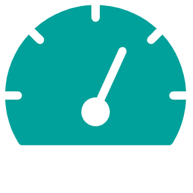

# PyProfGen
 Speed and position profile generator made in Python
 https://github.com/wernerpaulin/PyProfGen

<!-- APP SHIELDS -->

<!-- APP LOGO -->
 

  

  <h3 align="center">PyProfGen</h3>

  

    This profile generator is written in Python 3 using asyncio for concurrent of coroutines and paho-mqtt for communication.
     
    <a href="https://github.com/wernerpaulin/PyProfGen/issues">Report Bug</a>
    ·
    <a href="https://github.com/wernerpaulin/PyProfGen/issues">Request Feature</a>
  

<!-- TABLE OF CONTENTS -->

  
Table of Contents

  <ol>
    <li>
      <a href="#about-the-app">About The App</a>
      <ul>
        <li><a href="#built-with">Built With</a></li>
      </ul>
    </li>
    <li>
      <a href="#getting-started">Getting Started</a>
      <ul>
        <li><a href="#prerequisites">Prerequisites</a></li>
        <li><a href="#usage">Usage</a></li>
      </ul>
    </li>
    <li><a href="#communication">Communication</a>
      <ul>
        <li><a href="#interfaces">Interfaces</a></li>
        <li><a href="#published-ports">Ports Published By This App</a></li>
      </ul>
    </li>
    <li><a href="#data-management">Data Management</a></li>
      <ul>
        <li><a href="#environmental-variables">Environmental Variables</a></li>
        <li><a href="#volumes">Volumes</a></li>
      </ul>
    <li><a href="#information">Information</a></li>
    <li><a href="#legal-statemets">Legal Statements</a></li>
  </ol>

<!-- ABOUT THE APP -->
## About The App
[![Product Name Screen Shot][product-screenshot1]][![Product Name Screen Shot][product-screenshot2]]

**Features**:
* 100ms update interval 
* velocity and rotary speed profile
* position profile
* dynamic deceleration ramp calculation in position control mode

**Operating modes**:
* Velocity control
* Absolute position control
* Relative position control
* Automatic mode: cases the profile generator to initiate relative movements 
* Stop movement

### Built With
* [Python®](https://www.python.org/)
* [Eclipse Paho®](https://www.eclipse.org/paho/)
* [Docker®](https://www.docker.com/)

<!-- GETTING STARTED -->
## Getting Started

Find this app in the App Store and use it in a machine.

### Prerequisites

This app requires are MQTT broker which can either run as an app or in the same network of the Runtime.

### Usage
1. This app is per default connecting to the local Eclipse Mosquitto MQTT broker (available as app). If you choose to use another broker set or change the <a href="#environmental-variables">environmental variable "MQTT_BROKER_IP"</a>.
2. This app is per default connection to the broker via port 1883 which is the default port for MQTT. If you have multiple broker running in parallel each of these brokers require a separate port. Please sett the <a href="#environmental-variables">environmental variable "MQTT_BROKER_PORT"</a> accordingly.
3. An easy way to control this app is using Node-RED.

<!-- COMMUNICATION -->
## Communication
### Interfaces
The app publishes the following MQTT topics:

**Topic: "mosaiq.lenze.pyprofgen/parameteronconnect"**
Value example: "{"setDistance": 200, "setVelocity": 300, "setAcceleration": 200, "maxPosition": 1000000000, "minPosition": -1000000000, "maxVelocity": 500, "maxAccleration": 1000.0, "maxMotorRotarySpeed": 2000.0, "automaticCycleStopTime": 1.0}"

**Topic: "mosaiq.lenze.pyprofgen/monitor"**
Value example: "{"actVelocity": 0, "actPosition": 0, "actRotarySpeed": 0.0}"

The app subscribes to the following topics
**Topic: "mosaiq.lenze.pyprofgen/parameter"**
Value example: "{"setDistance": 200, "setVelocity": 300, "setAcceleration": 200, "maxPosition": 1000000000, "minPosition": -1000000000, "maxVelocity": 500, "maxAccleration": 1000.0, "maxMotorRotarySpeed": 2000.0, "automaticCycleStopTime": 1.0}"

**Topic: "mosaiq.lenze.pyprofgen/command"**
Value examples:
Stop: "MC_MoveStop"
Move relative: MC_MoveRelative
Move absolute: MC_MoveAbsolute
Automatic mode: MC_LE_AutomaticMode

### Published Ports By This App
| Container Port | Protocol | Description |
| -------------- | -------- | ----------- |
| n.a. | | |

<!-- DATA MANAGEMENT -->
## Data Management

### Volumes
Mount points are access points (like paths) to volumes provided to the app to read and write data:

| Mount Point | Default Data | Changeable by User | Description | 
| -------- | ------------- | ------------------ | ----------- |
| n.a. | | |

### Environmental Variables
Environmental variables are used to initialize or define a certain functionality of an app:
: IP address of broker. If not defined: "mosaiq.eclipsemosquitto"
MQTT_BROKER_PORT: Port of broker. If not defined: 1883

| Variable | Default Value | Changeable by User | Description | 
| -------- | ------------- | ------------------ | ----------- |
| MQTT_BROKER_IP | mosaiq.eclipsemosquitto | yes | Hostname or IP address of MQTT broker | 
| MQTT_BROKER_PORT | 1883 | yes | Port used by the MQTT broker |
| MQTT_BROKER_KEEPALIVE | 60 | yes | Maximum time that this app does not communicate with the broker |

<!-- INFORMATION -->
## Information
| Developer | Compatibility | Copyright | License |
| [Lenze SE](https://www.lenze.com/) | Requires Runtime 1.0 or later | Copyright [2021] [Lenze SE] | MIT License. See `LICENSE` for more information. |

## Legal Statements
"Python®" and the Python logos are trademarks or registered trademarks of the Python Software Foundation, used by Lenze with permission from the Foundation.
"Eclipse®", "Mosquitto®", Paho® and the respective logos are trademarks or registered trademarks of the Eclipse Foundation.
